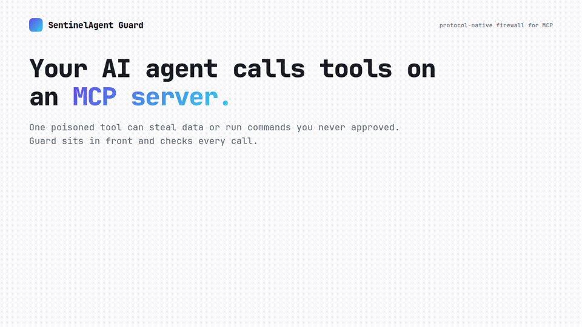

<div align="center">

# SentinelAgent Guard

### A protocol-native firewall for MCP servers and AI agents.

Blocks **tool poisoning**, **rug pulls**, and **data exfiltration** before they reach your agent — deterministically, with no LLM in the request path.

[](https://www.npmjs.com/package/@sentinelreign/guard-core)
[](./LICENSE)
[](https://nodejs.org)
[](#whats-detected)



</div>

---

## Why this exists

AI agents now hold real power — they read files, hit databases, touch production, move money — through **MCP (Model Context Protocol)** tools. MCP shipped almost no security. A malicious or hijacked MCP server can:

- **poison a tool** — hide instructions in a tool description that the human approving it never sees;
- **rug-pull** — silently change a tool *after* you approved it;
- **exfiltrate** — smuggle secrets out through a tool's response.

Enterprise firewalls don't understand the MCP protocol, and the MCP-native vendors are all "contact sales." **SentinelAgent Guard is that protection, open-source.**

## What makes it different

- **Protocol-native, not prompt-native.** It SHA-256–fingerprints every tool definition and diffs it on each listing (catching rug pulls), and decodes text hidden in invisible Unicode. Generic AI guardrails structurally cannot do this.
- **Deterministic, zero AI cost.** Detection is rules + hashes, not another model — sub-millisecond verdicts, no per-request token bill, reproducible and auditable.
- **Runs three ways**, including ones hosted-only vendors can't offer.
- **Free and readable.** Apache-2.0, on npm, self-host it today.

## Quickstart (30 seconds)

**Grade any MCP server — no install, no account:**

```bash
npx @sentinelreign/guard-proxy scan node ./your-mcp-server.mjs
```

**Or embed detection in your own MCP server — no key, no network:**

```bash
npm install @sentinelreign/guard
```

```ts
import { Guard } from '@sentinelreign/guard';

const guard = new Guard();               // no license key = full local detection, offline

const verdict = guard.verify({ kind: 'tools_list', tools });
if (verdict.decision === 'block') {
  // refuse the response — a poisoned tool or a rug pull was caught
}
```

That's it. Every detection check runs locally, in your process. Nothing is sent anywhere.

## Three ways to run

| Package | What it is | Use it for |
| --- | --- | --- |
| [`@sentinelreign/guard-core`](https://www.npmjs.com/package/@sentinelreign/guard-core) | The pure, zero-dependency detection engine | Call `evaluate()` anywhere |
| [`@sentinelreign/guard`](https://www.npmjs.com/package/@sentinelreign/guard) | Embeddable SDK (`Guard`, `wrap()`, Express middleware) | Protect your own MCP server, in-process |
| [`@sentinelreign/guard-proxy`](https://www.npmjs.com/package/@sentinelreign/guard-proxy) | stdio sidecar + the free `scan` CLI | Protect Cursor / Claude Code / any stdio server |

📖 **[Full usage guide →](docs/USAGE.md)**  ·  🛡️ **[All 22 detection checks →](docs/CHECKS.md)**  ·  💡 **[Examples →](examples/)**

## What's detected

**22 checks across 5 layers**, all deterministic, all running in microseconds:

- **L0 — Protocol conformance:** malformed / mismatched MCP requests.
- **L1 — Tool integrity:** rug pulls (hash diff), tool poisoning, **Unicode-concealed** instructions, cross-server shadowing.
- **L2 — Call-time policy:** deny-by-default allowlist, schema validation, targeted pattern rules.
- **L3 — Response inspection:** secret/keys/token egress (DLP) and injected-instruction detection.
- **L4 — Tamper-evident audit:** each record hash-chains to the previous one.

## Open-core — free forever, hosted for teams

Everything in this repo is **free and Apache-2.0**: run the engine, embed the SDK, use the CLI, self-host, forever. No key, no phone-home.

When a **team** outgrows self-hosting — a dashboard across many servers, centralized rules, tamper-evident + actor-attributed audit, **SIEM/OTel export, SSO**, an approvals queue, and a **managed, scaled gateway you don't run** — that's the hosted SaaS:

> **[guard.sentinelreign.com →](https://guard.sentinelreign.com)** · published pricing, a free tier, no procurement cycle.

The SDK's optional `licenseKey` connects an instance to that hosted control plane. It unlocks the *managed layer* — never the detection. Detection is always free.

## The SentinelReign ecosystem

Security for the agentic era, built end to end — research feeds the products.

| | | |
| --- | --- | --- |
| 🛡️ **SentinelAgent Guard** | The firewall (this repo) + the hosted SaaS | **[guard.sentinelreign.com](https://guard.sentinelreign.com)** |
| 🔬 **Andrax Pentester** | The research lab & **free MCP scanner** — 5,311 servers graded, 61 disclosures, 24 labs, 50 tools | **[andraxpentester.in](https://andraxpentester.in)** |
| 👑 **SentinelReign** | The parent company & roadmap | **[sentinelreign.com](https://sentinelreign.com)** |

Threats are found in the open at the lab, hardened into the `mcpgrade` rubric
everyone can read, then shipped as the products in this ecosystem.

## About the author

**Syed Zada Abrar** — security researcher, founder, and author, from Kashmir,
India. He runs the lab where the threats are found, wrote the rubric they're
graded against, and builds the products that enforce it. Off the terminal, he
also writes fiction.

- 🌐 [sentinelreign.com](https://sentinelreign.com) · 🔬 [andraxpentester.in](https://andraxpentester.in)
- 📖 Novel — *[Even If She Never Returned](https://notionpress.com/in/read/even-if-she-never-returned)*
- 💻 [GitHub](https://github.com/cyb3rvolt3x-A4lixhaS3ntin3l) · 📸 [Instagram @the_syedabrar](https://instagram.com/the_syedabrar)

If SentinelAgent Guard is useful to you, a ⭐ on this repo genuinely helps it
reach the developers who need it.

## Contributing & security

- 🤝 [Contributing guide](./CONTRIBUTING.md) — build, test, and PR in minutes.
- 🔐 [Security policy](./SECURITY.md) — report vulnerabilities to security@sentinelreign.com.
- 📦 npm: [`guard-core`](https://www.npmjs.com/package/@sentinelreign/guard-core) · [`guard`](https://www.npmjs.com/package/@sentinelreign/guard) · [`guard-proxy`](https://www.npmjs.com/package/@sentinelreign/guard-proxy)

## License

[Apache-2.0](./LICENSE) © Syed Zada Abrar / SentinelReign
